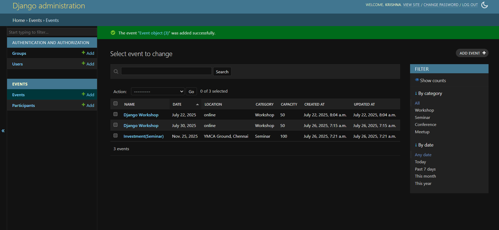
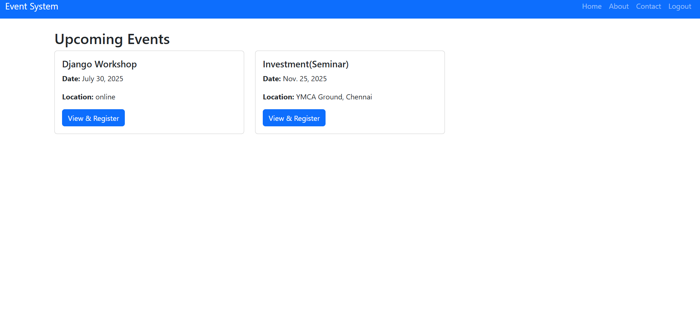
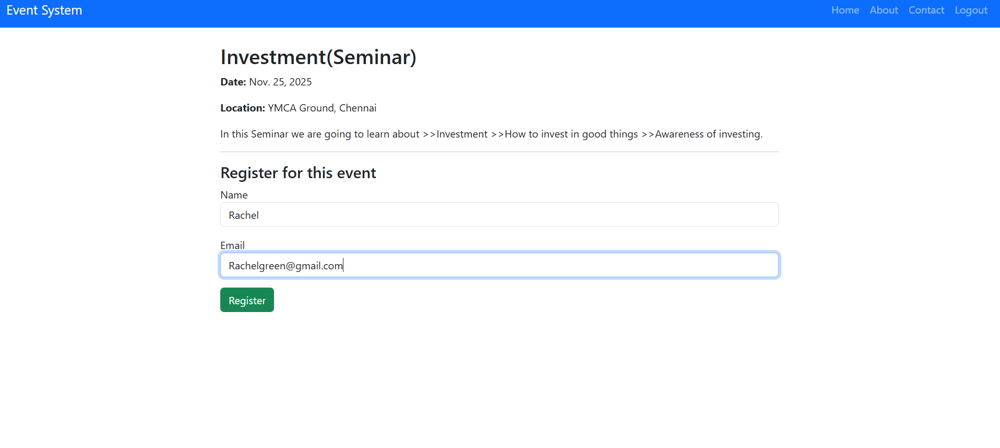
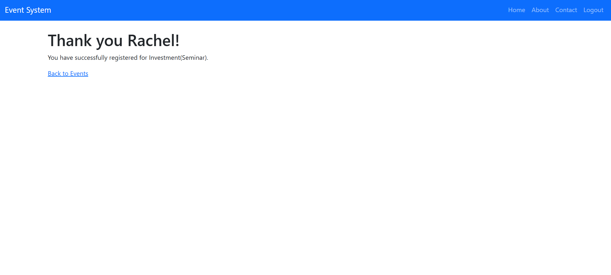

# Event Management System

A Django-based web application for managing events, including event listings, registrations, and user authentication.

## Features

- User registration and login
- Event creation and display
- Responsive templates with HTML
- Admin panel to manage events

## Tech Stack

- Python (Django)
- HTML/CSS
- SQLite3

## Getting Started

1. Clone the repository:
   ```bash
   git clone https://github.com/krrisshnaa/EVENT_MANAGEMENT.git

## 🔥 Screenshots

### 🛠️ Admin Page


### 🏠 Home Page


### 📝 Registration Page


### ✅ Successfully Registered Page


